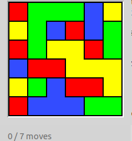

~ number: 1
~ title: JUnit testing, basic syntax, and linked lists

[JUnit]: http://en.wikipedia.org/wiki/JUnit
[Java Annotations]: http://docs.oracle.com/javase/tutorial/java/annotations
[Einstein quotation]: http://www.snopes.com/quotes/einstein/interest.asp
[skeleton]: http://en.wikipedia.org/wiki/Skeleton_(computer_programming)
[test-driven development methodology]: https://en.wikipedia.org/wiki/Test-driven_development

Navigation
----

- [Introduction to JUnit](#a-introduction-to-junit)
- [Arithmetic](#b-arithmetic)
- [Compound Interest](#c-compound-interest)
- [Multidimensional Arrays](#d-multidimensional-arrays)
- [Debugging](#e-debugging)
- [Starting Flood](#f-starting-flood)
- [Submission](#f-submission)

Prologue: `Make` setup
----
There is a standard Unix tool called `make` that is useful for quickly compiling code and running tests. We won't talk about how to use make in detail, but just know its a handy tool and can help you quickly compile your files when you've set up your project with a `Makefile`. In order to use it, you'll need to follow the brief [instructions](https://sp21.datastructur.es/materials/guides/make-install.html) here to install make. We'll also assume you successfully installed python in lab1.

When you run the make command, it will compile all of the .java files in your project directory and place the .class files in the project folder. The output may look something like:

```
"/Library/Developer/CommandLineTools/usr/bin/make" -C capers default
javac -g -Xlint:unchecked -Xlint:deprecation -cp "..::;..;" CapersRepository.java Dog.java Main.java Utils.java
touch sentinel
```

Note that this may look pretty different if you're running a different operating system (e.g. Windows). You don't need to understand what any of this means, but in simple terms it's just compiling your files.

A. Introduction to JUnit
----

In hw0, you saw an example of _unit testing_, the testing of individual
components (methods) of a program in `Tester.java`.  In unit testing, you write extra code that
is not used in the actual operation of your program, but is
instead intended for use during development to find and localize bugs as
they happen.

##### Why is testing important?
Let's say we have a giant project to keep track of users' accounts and the overall worth of their stocks. The project comprises 10 classes, each with a wide range of methods and constructors. In testing our project, we find out that one of the user's overall worth for 2020 is off by 19 cents.

Where do we start looking for the problem? Do we look for errors in how we store each user's balance? Do we look for errors in how we calculate interest over time? Determining where the bug is coming from may take longer than writing the program itself!

Testing each individual piece helps us avoid this problem. When we finish our interest calculation method, we write a small test which helps us feel confident that our method is working correctly, and fix whatever bugs we are able to find. When we know that our foundation is solid (that all of the individual methods we wrote should be working correctly), we can move forward to actually using our code without worrying.

##### Setup
To support unit testing our programs, we'll rely on a widely used testing package called
[JUnit][]. Your instructor has been
quoted saying that "it is one of the most poorly documented bunches of Java
code I've seen," so we'll jump right into using it, rather than going to
any official documentation.

As with any assignment, start this homework by running the following commands in your
local `repo` directory.

    git fetch shared
    git merge shared/hw1 -m "start HW 1"
    git push

You'll receive a hw1 folder with four subdirectories: `Arithmetic`,
`CompoundInterest`, `MultiArr`, and `Flood`.  Arithmetic contains a fully implemented
sample program and JUnit tests, and `CompundInterest` and `MultiArr` are programs that
you'll need to implement for this homework. `Flood` is a helpful introduction to Proj0, and while it's technically not graded for this homework, doing it will give you the answers to the first method of the project!

Open the hw1 folder in IntelliJ using the **Open** command from the main menu. Remember
to import the libraries in `cs61b-software/lib` by **File > Project
Structure > Libraries** and clicking on the plus button.

#### Ad-hoc Testing in Java

Let's start by examining the already completed contents of the
`Arithmetic` folder. In it, you'll see a very simple arithmetic package in
a file named `Arithmetic.java`, along with a couple of *test clients* named
`ArithmeticTest.java` and `ArithmeticJunitTest.java`. In case you're
unfamiliar with the term, a program X is said to be a _client_ of the
program Y if X uses any data or methods from program Y. In this case, the
purpose of our two clients will be to test the class `Arithmetic`.

The `ArithmeticTest` test client is an ad-hoc test written entirely from
scratch.  Don't try to understand the details or even the flow of the
test, just _briefly_ look at the overall structure, noting the length and
the nature of the methods implemented.

You'll observe that the source code is 56 lines long, and has to manually
implement common tasks like approximate floating point comparison,
tallying of tests passed, and provision of useful test output for the
human user. There are various ways to run the tests.
Try running the file `ArithmeticTest.java` in IntelliJ. You should
see the output:

    product OK.
    sum FAILS.

Another alternative is to use the command line to compile
the program. To do this, in the `Arithmetic` folder, you can enter the command `make` (or compile `ArithmeticTest.java` with `javac`)
and then run it with `java ArithmeticTest` (or do both with `make adhoc-check`).
This should give the same output.


#### JUnit Testing

The JUnit package does a lot of the kludgy work for us, avoiding
implementation of common testing tasks such as those we saw in
ArithmeticTest. Basic JUnit tests tend to leverage a few key components:

1. A set of methods with names like `assertTrue` and `assertEquals` that
   perform some simple tests and cause an error if it fails.
2. A number of "annotations," such as `@Test`, which marks a method as
   being a unit test.
3. Various main testing routines that examine
   specific classes at execution time and call all of their annotated test methods,
   i.e. those methods with `@Test` proceeding their definition.

As an example, look at the `Arithmetic/ArithmeticJUnitTest.java` JUnit-
based arithmetic test client:

- It starts with two lines that begin with `import`.
  These lines just mean that our program will be able to utilize
  shorthand names for items in the JUnit libraries: for example,
  `assertEquals` rather than `org.junit.Assert.assertEquals`.
- Some of the methods have `@Test` right above their declaration.
  This is an example of an
  [annotation][Java Annotations]
  which attaches various "metadata" to a Java entity that
  is then accessible by the Java program itself.
  As an example, the JUnit framework is a Java program that looks for methods
  that have the @Test annotation, and then executes each such method found.

- The main method performs the task
  `System.exit(ucb.junit.textui.runClasses(ArithmeticJUnitTest.class))`.
  This just means that every method in the class
  `ArithmeticJUnitTest` that has the annotation @Test is to be run, and
  the results accumulated and reported.

In this homework, you'll write your own such JUnit tests, which can be compiled and executed with the command `make check`.

There are a number of advantages to using JUnit-based testing over the
ad-hoc test above: the JUnit test is only 29 lines long, is easier to read,
and avoids implementation of common tasks like approximate floating point
comparisons, and so forth. Furthermore, when run, it also provides us with
a more useful output for debugging purposes:

    Time: 0.018
    There were 1 failures:
    1) testSum(ArithmeticJUnitTest)
    expected:&lt;11.0&gt; but was:&lt;30.0&gt;
    at ArithmeticJUnitTest.testSum:14 (ArithmeticJUnitTest.java)
    Ran 2 tests. 1 failed.

JUnit tests are easy to write once you learn the basics and give
you useful output, straight out of the box.  We hope you'll grow to love
them.

B. Arithmetic
---
Open up `Arithmetic/ArithmeticJUnitTest.java`. Try looking through the file. Try running the tests. Do they pass or fail (spoiler: they should fail). Now, open `Arithmetic/Arithmetic.java` and look through the code until you find the mistake and fix it. Try running your tests again. They should pass now.

C. Compound Interest
----

"Compound interest is the most powerful force in the universe." - Albert Einstein [(maybe)][Einstein quotation]

Investment income grows faster than inflation, and thus the choices you
make about investment at an early age can make a huge difference in how
much money you'll have when you retire. In this homework problem, we'll
build some code to explore this idea, and we'll also get some practice
with the idea of test-driven-development using JUnit.


Go into the CompoundInterest folder, and you should see
CompoundInterest.java, CompoundInterestTest.java, and Makefile. The `.java` files are each a
[skeleton][].
Your goal in this problem is to fill in all the methods in both
`.java` files to match the comments.

As you work, try to use the [test-driven development methodology][]
where
you do things in the following order:
1. Write the test.
2. Run the test (you
should fail).
3. Write the code.
4. Run the test (you should pass).
5. Refactor if desired and if so, re-run test. Repeat as necessary until code passes tests.

To run the tests in `CompoundInterestTest.java`, select the file and click on
**Run > Run 'CompoundInterestTest'** in IntelliJ. You'll see
that the unit tests report that all tests have passed. This is bad,
because it means that our starter test is garbage, as it believes our
incomplete CompoundInterest.java is flawless.

By the way,
you can also run the starter test from the command line in the directory where this homework is like this (if you have
`make` installed):

```
$ make check
```

which (as you can see from `Makefile`) runs the command

```
java CompoundInterestTest
```

after first making sure that `CompoundInterestTest.class` is up to date.

The rest of section C of this homework spec describes a suggested path to
completion. You do not have to follow it, but it is recommended. If you
set off on your own from this point on to Part 1, please give the test-first
approach a fair shake. We strongly believe it will save you grief in the future.

#### `testNumYears`

Start this homework by opening `CompoundInterestTest.java` and
`CompoundInterest.java` in intelliJ. In
`CompoundInterestTest.java`, you'll see a bunch of tests you're supposed to
implement.

We'll start by writing a test for the simplest method, `numYears`, which essentially asks for the difference between the argument `targetYear` and `THIS_YEAR`, which is a static value in the `CompoundInterest` class. We have it set such that `THIS_YEAR` is 2021, and you don't need to change this.

Using `Arithmetic/ArithmeticJUnitTest.java`
as a guide on how to write a JUnit test, edit the `testNumYears`
method so that it acts as a good test of whether or not `numYears` obeys
the specifications given in the documentation comments in
`CompoundInterest.java`.

If you're stuck on where to start, try taking the following plain English and figuring out how to translate it into a JUnit test, using `Arithmetic/ArithmeticJUnitTest.java` as a reference:

1. If we were to call the `CompoundInterest` class's `numYears` method with the argument 2021, we'd want it to return 0.
2. If we were to call it on the year 2022, we'd want it to return 1.
3. If we were to call it on the year 2121, we'd want it to return 100!

You should be able to do the above in 3 lines, and then you'll have a test that pretty thoroughly vets our simple method!

After you've created your test, run it, and your
`numYears` method should now fail the test.  Ironically, this shows that
the test is working!  In fact, experienced programmers get suspicious when
they write a bunch of tests that _don't_ fail out of the box.

#### `numYears`

Now edit `numYears` in CompoundInterest.java so that it passes the test.
It should be a straightforward method to write.

While it might be a little silly to write a unit test for something as
trivial as numYears, once you get used to JUnit testing, the time taken to
write a test becomes so small that you may as well write at least a basic
test for every method. This will save you sweat and tears down the line.

#### `futureValue`

Repeat the exercise from before, but now with the `testFutureValue` and `futureValue` methods. Write the test first, and verify that it compiles and fails before moving on to writing `futureValue`. Feel free to use the example in the documentation comments as one of your JUnit tests.

Make sure your test includes negative appreciation rates.

#### `futureValueReal`

Now we'll write a method that computes the future value of an appreciating
(or depreciating) asset taking inflation into account. Having a
million dollars today is very different from what it will be in 60 years.

To correct for inflation, one simply considers how much an asset would be
worth if it hypothetically depreciated at the inflation rate for the
appropriate time frame. For example, if we want to know how much 1,000,000
dollars in cash will be worth in 40 years and we assume the inflation rate will be
3 percent over the next 40 years, we'd see it would be worth $$\$1,000,000 \times
(0.97)^{40}$$ or $295,712.29 in 2020 dollars. Not bad, but not quite so
impressive.

Again, start by writing the tests, then run the tests to see they
successfully compile and fail, and then finally write code for
`futureValueReal` that passes the tests.

#### `printDollarFV and CompoundInterest.main`

Using what we've written so far, we can answer our first interesting
question: How much money is future-you losing every time present-you spends
a dollar? They say a penny saved is a penny earned, but this is only true
if you're a bad investor. In fact, each penny is worth many pennies.

Try running CompoundInterest's main function, and you'll see that it tells
you something that is clearly not true (assuming that we don't go through
an apocalyptic event that eradicates the value of all money). Update the
printDollarFV function so that it gives you a correct result.


#### `totalSavings` and `totalSavingsReal`

Another more interesting question: How much money will you have if you set
aside some fixed amount each year? To lay the groundwork, repeat the same
exercise as above for `totalSavings` and `totalSavingsReal.`

#### `printSavingsFV` and `CompoundInterest.main`

As the final step in this assignment, edit `printSavingsFV` so that it
gives you useful information about how much money you'll have if you save
`perYear` dollars every year until `targetYear`.

D. Multidimensional Arrays
---

Test-driven development (TDD) particularly shines when you have a task whose
outcome is conceptually easy to understand but hard to implement. Let's
try out the TDD methodology in the context of recursive data structures.

This assignment will be diving into the world of multidimensional arrays! We know that an array is a list of objects (integers, strings, Objects, etc). But what happens when we put an array inside an array? What about when those internal arrays are themselves filled with arrays? [It's turtles all the way down](https://en.wikipedia.org/wiki/Turtles_all_the_way_down)!

Indexing into these types of data structures can get confusing as the number of dimensions increases, but if you can draw a mental map of the dimensions the indexing follows. Row indices always comes first, followed by column, and then by any additional following dimensions. For example, this is what a two dimensional array looks like.


To cement the idea of indexing into multiple dimensions, try implementing `printRowAndCol` (which will *not* be graded).

Then, start by opening `MultiArrTest.java` and implementing `testMaxValue`. Run the test to ensure it fails.
After writing `testMaxValue`, implement `maxValue` to return the maximum value found in a multidimensional array. Then, move on to `testAllRowSums` followed by `allRowSums`. Further details of functionality and examples can be found in the skeleton code.

E. Starting Flood
----
For this part of the assignment you will be introduced to Project 0: Flood. Flood is a board game that is played on a $$W \times H$$ rectangular grid of square cells. Every square's color comes from a set of available colors, which are represented as integers in our code. For this assignment, we are only concerned with a small component of the overall project.
We provided the `Model` class, which represents a Flood puzzle. This class is a simpler version of the one that you will receive (and need to help write) in Project 0. You are also given the `PuzzleGenerator` class.
The `getPuzzle(int width, int height, int ncolors, int extra)` method should return a `Model` instance representing a random Flood puzzle of the specified width and height, choosing randomly from the specified number of colors. For example, `getPuzzle(6, 6, 4, 0)` could return a `Model` representing this Flood puzzle:




Note that the resulting puzzle is 6x6, with 4 possible colors for each cell. In the underlying nested array that represents the puzzle, notice that all the values in the inner arrays will be `ints` 0-3, and each corresponds to one of the four possible colors. If there were 5 different colors in the image, `getPuzzle` would be wrong as the `ncolors` argument was 4. The final argument to `getPuzzle` can be ignored for this exercise, but will be relevant when you do the full project.

Additionally note that though these colors are chosen randomly, `PuzzleGenerator` uses a value called a "seed" when instantiated. We will touch on pseudorandom number generation later in the semester, but you can read more about the java [Random class](https://docs.oracle.com/javase/8/docs/api/java/util/Random.html) and [PRNG](https://en.wikipedia.org/wiki/Pseudorandom_number_generator) if you so desire.
For this assignment, all you need to know is that two `PuzzleGenerator` objects created with the same seed must generate the same `Model` when called with the same arguments. In other words, the color selection should be **predictably random**, which may seem like an oxymoron! The key is that the values themselves seem totally random (thus leading to interesting looking puzzles), but we can recreate it whenever we desire (which is important for testing).

The `getPuzzle` method provided is almost fully implemented, but includes a few small bugs.

Open this assignment in IntelliJ. Read over the description for this method, run the unit test (which will fail since the code provided is buggy), and observe its output. Once you've read the debugging section below and feel comfortable with how the debugger works, try running through `getPuzzle` by setting a breakpoint.
This is code you will use for Project 0, so you are already starting on the project! One of your tasks in Project 0 will be to implement the method `getPuzzle`, which is included here. Once you have fixed the bugs here (by passing the unit tests), *feel free to use your solution from this homework on the actual project*. Please note that you still may need to make some changes to this method (particularly surrounding setting the limit) when completing `getPuzzle` in Project 0.

### Debugging
So, we've figured out how to write unit tests. But whats next–if we find out we're failing a test, how can we fix the issue? Sometimes, even when your unit test is targeting a really specific part of your project, it can be hard to pinpoint where it's going wrong. This is why the debugger important. This is a tool built into which allows you to step through your code line by line, providing a visual layout showing you the values of every variable at that moment in the code (using the Java Visualizer).

First, read [this](https://www.jetbrains.com/help/idea/debugging-your-first-java-application.html).

In Intellij, take a look at the provided `Flood/PuzzleGenerator.java` file and try setting a [breakpoint](https://www.jetbrains.com/help/idea/using-breakpoints.html) by clicking to the right of the line numbers. Breakpoints are lines of code where we want the debugger to stop running and let us start stepping through at our own pace. This is useful as our aim is to use the debugger to test a specific part of our program. For example, let's say we thought the problem was maybe something to do with how we iterate through the columns. We might set our breakpoint on line 17 then.

To run the debugger, click the bug icon in the top right, or right click the green run arrow to the left of the method and select the second option, "Debug".

Now, how do we actually walk through our code? Read [this breakdown](https://www.jetbrains.com/help/idea/stepping-through-the-program.html) of the step buttons. Note that the first four are likely the only ones you will use. Try stepping through the entirety of our loop!

Next, stop the debugger if its still running, and try right clicking your breakpoint (on the red dot). A small dialog should appear with a section for a "Condition". Try putting in a condition for a specific variable (such as `col==3`). See how the debugger acts differently!

F. Submission
----
You should turn in a functioning Arithmetic.java, CompoundInterest.java, and MultiArr.java (each with their appropriate testing files!) and the corrected Flood code!

To submit, follow the same instructions as for lab1:

When you're done with the assignment and have properly added and
committed your changes (`git commit -m` ...), submit them:

    git tag hw1-0       # or hw1-1, hw1-2, etc. for resubmissions
    git push
    git push --tags

In order to receive full credit your submission must pass 10/15 of the autograder tests on Compound Interest, 3/5 on Multidimensional Arrays, and 1/5 of unit test tests. You must pass all of your own unit tests. Again, the Flood code is not graded, but we're literally giving you a part of the solution, you just have to debug it! It's in your best interest to complete it.
